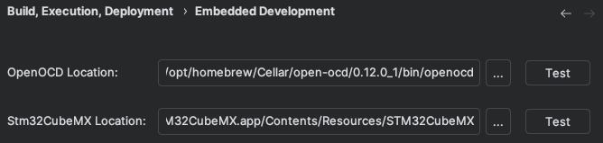
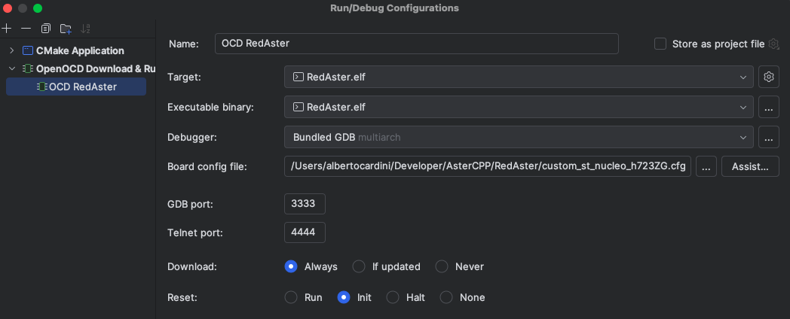

# Build RedAster outside STM32CubeIDE

Follow the next steps to build the project with CMake on any platform.

### Requirements:

* __CMake Version__:
   The project requires the 3.28 minimum version for CMake, so make sure to have the right version installed. To check 
the version:
   ```
   cmake --version
   ```
* __Arm GNU Toolchain__:
  To build an embedded project base on Amr Cortex is required to have the right compiler toolchain.
  Download it from [Arm's official website](https://developer.arm.com/downloads/-/arm-gnu-toolchain-downloads) for your OS.
  Or get it with a package manager.
  
  macOS:
  ```
  brew install arm-none-eabi-gcc
  ```
  Linux:
  ```
  sudo apt-get install arm-none-eabi-gcc
  ```
  Windows:
  ```
  choco install gcc-arm-embedded
  ```
### Build the project:
At this point you have the needed tools. Run the following bash commands to create a folder called __build__ to store all 
the files generated by CMake, including the .bin and .elf files. The -S flag is needed to provide the directory that 
contains the source files (" . " means the directory you are located right now), and -B flag specifies the build directory 
(if it does not exist CMake will create it for you). Then you run the command that actually builds the program.

```
cmake -S . -B build # use the current directory as source dir and create build 
cmake --build build # compiles the project in the build folder
```

# Debug RedAster in CLion

Follow the next steps to debug the project with CLion.

### Requirements:

* __Open OCD__:
   First of all you have to have installed Open OCD (Open On-Chip Debugger), an open-source utility to debug microcontrollers.
   It can be installed through a package manager:
   
   macOS:
   ```
   brew install open-ocd
   ```
  Linux:
   ```
   sudo apt-get install openocd
   ```
  Windows:
   ```
   choco install openocd
   ```
* __GDB__:
   Make sure to have installed GDB (GNU Debugger). It can be installed through a package manager:

   macOS:
   ```
   brew install gdb
   ```
   Linux:
   ```
   sudo apt-get install gdb
   ```
   Windows:
   Follow the instructions on this page: [MinGW System](https://sourceforge.net/projects/mingw/files/MinGW/).

### Create the CLion Configuration:
Follow the next steps to debug your code inside CLion:

1. Go in the settings and set the Embedded Development specifications.
2. Create a new configuration for your build. Make sure is an "OpenOCD Download & Run" type of configuration.
   
   <p align="center">
       
   </p>
   
3. Now fill the settings with as "Target and Executable binary" the RedAster.elf . Then as "Board config file" specify 
   the path of the "custom_st_nucleo_h723ZG.cfg" present in the repo.
   
   <p align="center">
       
   </p>